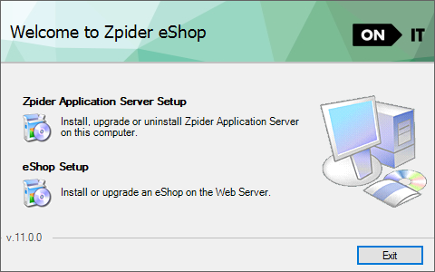
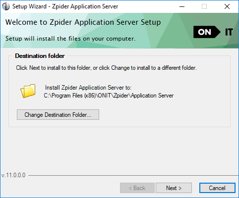
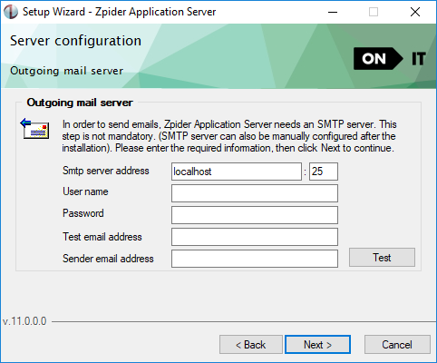
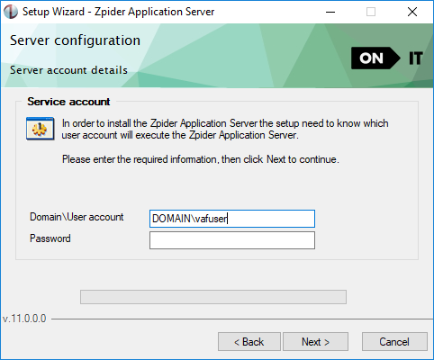
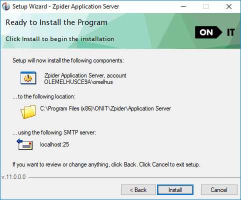

## Prerequisites

It is recommended to install the Zpider Application Server on the same server as the ERP system.

- If the Zpider Application server is not installed on the ERP system server, the network capacity must be at least 1 Gbps between the Zpider Application Server and the ERP system server / SQL server.
- The setup must be executed with a domain user with full access rights (local administrator) for the current machine.
- The user must also have enough access rights to access network resources (SQL server, ERP server e.g.).

## Installation

Log on to the server with a user with the domain user described in the chapter above and unpack and start the installation of Zpider Application Server.



### Destination folder

Choose the destination folder. For simplifying support situations it is recommend to use the default folder.



### Outgoing mail server configuration

In Zpider eShop the following functionality requires communication with a SMTP server.

- Order confirmations sent by email to the customer
- Password can be sent to a user using the forgotten password functionality
- Username and password can be sent by email to a web user from the eShop admin application
- Email can be sent to a web user by defining a customer / contact person in the ERP system with an import profile where mail sending is enabled

The SMTP server to communicate with must be entered in the SMTP server address field. In the same line it is possible to configure port for SMTP communication (port 25 is default).

Click the test button to test communication with the SMTP server.

Many SMTP servers are configured to successfully deliver email internally but not externally. The "Test email address" field and the "Sender email address" field" can be used to test if the SMTP server is configured to deliver email form an internal mail address to an external email addresses.



#### Update the SMTP credentials

The SMTP configuration is stored in `FusionServer.config`. If you need to set a username and password for your SMTP connection, have a look at this example.

```xml
<?xml version="1.0" encoding="utf-8"?>
<FusionConfiguration>
  <SessionTimeout>60</SessionTimeout>
  <Port>6792</Port>
  <MailServer>smtp.sendgrid.net</MailServer>
  <MailServerPort>587</MailServerPort>
  <MailServerUserName>username</MailServerUserName>
  <MailServerUserPassword>password</MailServerUserPassword>
</FusionConfiguration>
```

**Office365**

Remember that the sender email must be the same as the MailServerUserName.

```xml
<?xml version="1.0" encoding="utf-8"?>
<FusionConfiguration>
  <SessionTimeout>60</SessionTimeout>
  <Port>6792</Port>
  <MailServer>smtp.office365.com</MailServer>
  <MailServerPort>587</MailServerPort>
  <MailServerUserName>user@domain.com</MailServerUserName>
  <MailServerUserPassword>P@assw0rd!</MailServerUserPassword>
  <MailServerEnableSsl>true</MailServerEnableSsl>
</FusionConfiguration>
```

### Service account

The user account provided at this step will be associated with the server service process. The user must have enough access rights to access network resources ( SQL server, ERP server e.g.)

Note that if you are unable to verify the service account you can use ctrl+click on the next button in order to continue.



### Summary

This step is a summary of the information entered in the previous steps.

Click install to execute the installation.


