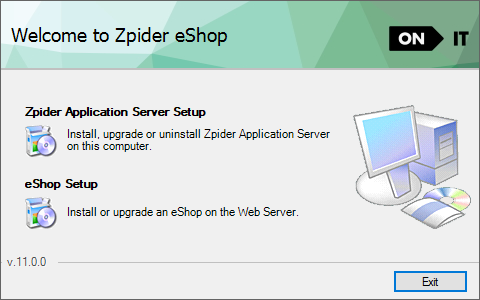
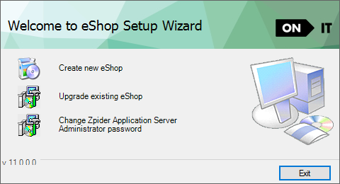
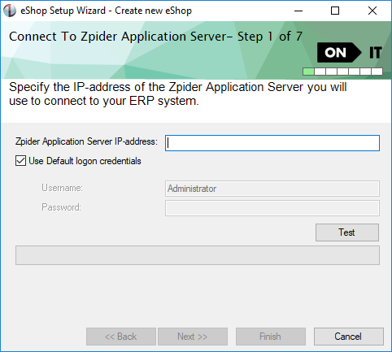
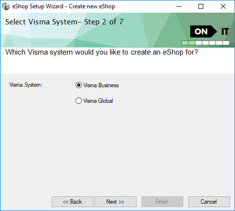
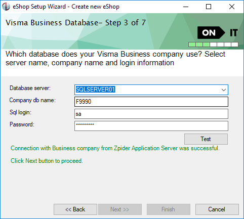
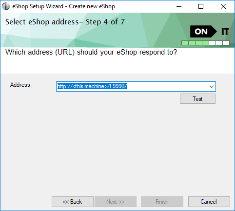
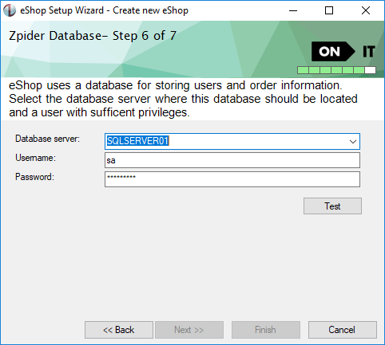
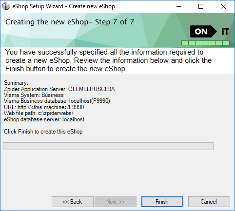

Log on to the web server and start the installation of eShop setup.

Click on "Create new eShop" to create a new eShop.

Read the text in the screen shots for description of what to do.

The test button must be clicked and the test must be successful to enable the [Next] button in all steps in the wizard.

If a test returns an error read the error message, take the appropriate action to resolve the error and click the test button again.

### Connect to Zpider Application Server

The test button tests if the web server is able to establish a connection with the Zpider Application Server.

### Select Visma ERP system

#### Visma Business Database

Step 3 in the wizard is dependent of which Visma System that was selected in step 2.

If Visma Business was selected following step will appear:

The test button tests if it is possible to login to the data base with the entered information. It also tests if it is a Visma Business database and if it is a Zpider supported version of Visma Business.

#### Visma Global Company login

Step 3 in the wizard is dependent of which Visma System that was selected in step 2.

If Visma Global was selected following step will appear:

Enter the Global server name, Global company login name, Global company password. After filling in these fields you can click the Fetch button which will list the available Global companies for this login. Select a Global company name from the drop down list or manually enter the Global company name. The Test button tests if it is possible to log in to the Global client with the "Global company login name" as the user. This means the user entered in the "Global Company login name" must have access rights to enter the Visma Global client.

If the test is successful and you click Next in the wizard it will use standard VAF architecture rules to find database information based on the information entered. If this information is correct the [Next] button will automatically be enabled in the next step. If the database information does not follow standard VAF architecture rules the data fields will be editable and a new test can be run after correction of the information.

### eShop address (URL)

The test button will parse the entered URL to find an host header and virtual directory. This information is used to connect to the local Internet Information Server to check if we can create the website and the virtual directory.

The suggested virtual directory is based on the company name of the ERP system, but this can be changed.

The &lt;this machine&gt; means all requests on port 80 to this machine.

Invalid characters in the edit field will be removed.

### Zpider Database

The test button checks if it is possible to login to the data base with the entered information. It also checks if the entered user has sufficient privileges for creating the database and database tables.

Ideally this should be the same server as the ERP application is using.

### Summary

The last step provides a summary of the information entered in the previous steps.

### Finish

Clicking the Finish button starts the installation of the new eShop.
