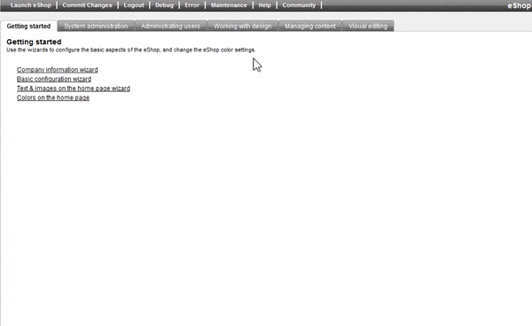

# How to show an additional field from ERP and make it searchable #

## Question

How to present an additional field from ERP and make it searchable in Zpider?

## Solution

### 1. In order show an additional field in Zpider we first need to check if it is part of the database query.

For Visma Global this is located in the configuration file located at `Application Server\Users\eShop.ZDemo.user\Global\Config\global.7.50.database.model.config`, and for Visma Business in `Application Server\Users\eShop.ZF9985.user\Business\Config\business.4.60.database.model.config`.

Search for `qry_article_full` and make sure that the field you want to show is part of the query. In the following example I've added AltArtNo.

```sql
<QueryBody Provider="MSSQL">
SELECT
    ART.ArticleNo [Number], ART.EANNo, ART.MainGroupNo, dbo.GetArticleText(ART.ArticleNo,@LanguageId,ART.Name) [Name],
    ART.SubGroupNo, dbo.GetArticleUnitText(ART.ArticleNo,@LanguageId,ART.QuantityPerUnitTextSale) [UnitText],
    ART.Weight+ART.PackingWeight [GrossWeight], ART.NumberOfDeliveryDays [DeliveryTime], ART.GrossPrice, ART.PackingWeight,
    ART.Price1 [Price], ART.InActiveYesNo, ART.UtilityBits, ART.Volume, ART.IntermediateGroupNo [InterGroupNo],
    ART.EUFiguresNo [EUGoodsStatisticsNo], ART.PurchasePacking, ART.QuantityPerUnitSale [UnitAmount],
    MAI.Name [MainGroupName], SUB.Name [SubGroupName], ING.Name [IntermediateGroupName], WAR.Name [StockLocation],
    ART.AltArtNo
FROM Article ART
    LEFT OUTER JOIN MainGroup MAI ON MAI.[MainGroupNo] = ART.[MainGroupNo]
    LEFT OUTER JOIN SubGroup SUB ON SUB.[SubGroupNo] = ART.[SubGroupNo]
    LEFT OUTER JOIN IntermediateGroup ING ON ING.[IntermediateGroupNo] = ART.[IntermediateGroupNo]
    LEFT OUTER JOIN WareHouse WAR ON WAR.[WareHouseNo] = ART.[WareHouseNo]
WHERE
    ART.InActiveYesNo IN (0,3,6) AND ART.ShowOnWebYesNo = 1
</QueryBody>
```

### 2. Make the field searchable

In order to make the field searchable we have to add it to the pattern search. This is within the same query definition in the configuration file. Here I've added AltArtNo as a part of the search query.

It is important that you make the same changes to the query `qry_article_search`.

```xml
 <QueryParams>
    <QueryParam Name="@LanguageId" SqlType="String" Description="LanguageCode" />
    <QueryParam Name="SinglePatternSearch" Description="Search filter condition used when a single word is given">
        $MainGroupNo > 0 AND (PATINDEX(@LikeSearch, $Name) > 0 OR PATINDEX(@LikeSearch, $Number) > 0) OR PATINDEX(@LikeSearch, $AltArtNo) > 0)
    </QueryParam>
    <QueryParam Name="FlexiPatternSearch" Description="Search filter condition when multiple words are given (max three)">
        $MainGroupNo > 0 AND (PATINDEX(@LikeSearch, $Number) > 0 OR (PATINDEX(@SearchWord0, $Name) > 0 AND PATINDEX(@SearchWord1, $Name) > 0 AND PATINDEX(@SearchWord2, $Name) > 0) OR (PATINDEX(@SearchWord0, $AltArtNo) > 0 AND PATINDEX(@SearchWord1, $AltArtNo) > 0 AND PATINDEX(@SearchWord2, $AltArtNo) > 0))
    </QueryParam>
    <QueryParam Name="FieldPatternSearch" Description="Searches within a specific column">
        PATINDEX(@SearchWord0, ${0}) > 0 AND PATINDEX(@SearchWord1, ${0}) > 0 AND PATINDEX(@SearchWord2, ${0}) > 0
    </QueryParam>
</QueryParams>
```

### 3. Add the field as webattribute to the modules ARTICLE and ARTICLELIST
